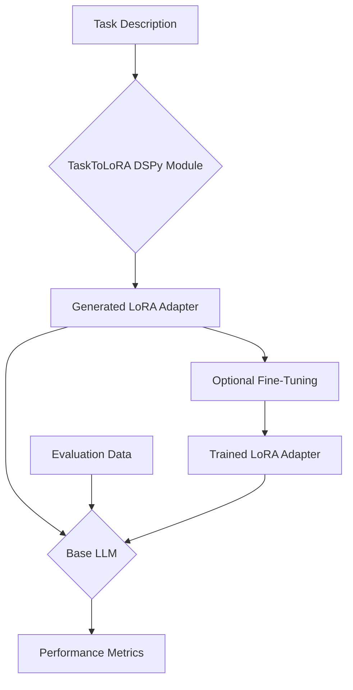

# dspy-t2l: Task-Adaptive LoRAs with DSPy

[](https://arxiv.org/abs/2405.15043)
[](https://github.com/SakanaAI/text-to-lora)

This project demonstrates how to compose [Stanford's DSPy framework](https://github.com/stanford-oval/dspy) with [Sakana AI's Text-to-LoRA (T2L)](https://github.com/SakanaAI/text-to-lora) hyper-network. The result is a system that can generate and evaluate specialized LoRA adapters for large language models based on simple, natural language task descriptions.

The core of this repository is the `TaskToLoRA` module, a `dspy.Module` that wraps the frozen T2L hyper-network. This allows for dynamic creation of LoRA adapters, which can then be used for inference or further fine-tuned.

## Background: Text-to-LoRA (T2L)

The official Sakana AI paper, "[Text-to-LoRA: Instant Transformer Adaption](https://arxiv.org/abs/2405.15043)," introduces a hyper-network that generates LoRA weights for a base model from a task description. This allows for on-the-fly specialization of a model to a new task without requiring a full fine-tuning run. The T2L model takes a string (the task description) and outputs a full set of LoRA weights compatible with a specific base model.

This project uses a pre-trained T2L model to generate LoRA adapters for different tasks and evaluates their performance.

## High-Level Architecture

The system is composed of several layers:

- **Base Model**: A frozen base LLM (e.g., `google/gemma-2-2b-it`).
- **Hyper-Network**: The pre-trained T2L model from Sakana AI, which generates LoRA adapters.
- **DSPy Module**: The `TaskToLoRA` class, which wraps the T2L hyper-network and exposes it as a `dspy.Module`.
- **Generated LoRA Adapter**: A LoRA adapter generated on-the-fly by the T2L hyper-network.
- **Trained LoRA Adapter**: A generated LoRA adapter that has been further fine-tuned on a specific task.
- **Evaluation Suite**: A set of scripts using `dspy.Evaluate` to measure the performance of the adapters.



## Installation

1.  **Clone the repository:**

    ```bash
    git clone https://github.com/jjanousek/dspy-t2l.git
    cd dspy-t2l
    ```

2.  **Create a virtual environment and install dependencies:**
    This project uses `uv` for package management.

    ```bash
    # Install uv if you don't have it
    pip install uv

    # Create a virtual environment and sync dependencies
    uv venv
    uv sync
    ```

3.  **Download the T2L model:**
    You will need to download the pre-trained T2L model from Sakana AI's Hugging Face repository.
    _You may need to log in to Hugging Face CLI: `huggingface-cli login`_

    ```bash
    # Example for gemma-2-2b-it
    huggingface-cli download SakanaAI/text-to-lora --local-dir trained_t2l/gemma_2b_t2l --include "trained_t2l/gemma_2b_t2l/*"
    ```

    Place the downloaded model into the `trained_t2l/` directory. This path is configurable in the evaluation script.

## Usage

The primary entry point for this project is the `scripts/evaluate.py` script. It can be used to evaluate both "generated" (zero-shot) and "trained" (fine-tuned) LoRA adapters.

### Evaluating a Generated LoRA

To evaluate a LoRA adapter generated directly from a task description, use the `--mode generated` flag:

```bash
python scripts/evaluate.py \
    --mode generated \
    --task code \
    --shots 5 \
    --t2l-dir trained_t2l/gemma_2b_t2l
```

- `--task`: Specifies the evaluation task. Options are `code` (GSM8K) and `medical` (MedMCQA).
- `--shots`: The number of few-shot examples to provide to the model.
- `--t2l-dir`: The directory containing the pre-trained T2L model.

### Evaluating a Trained LoRA

If you have a fine-tuned LoRA adapter, you can evaluate it using the `--mode trained` flag. The script expects the trained adapter to be located at `artifacts/{task}_trained.lora.pt`.

```bash
python scripts/evaluate.py \
    --mode trained \
    --task code \
    --shots 5 \
    --t2l-dir trained_t2l/gemma_2b_t2l
```

## Directory Structure

- `src/`: Core source code, including the `TaskToLoRA` DSPy module.
- `scripts/`: Evaluation and other utility scripts.
- `data/`: Datasets for evaluation, organized by task.
- `trained_t2l/`: Location for the pre-trained T2L hyper-network models.
- `artifacts/`: Output directory for trained LoRA adapters and other generated files.
- `configs/`: Configuration files for training and evaluation.
- `chat_templates/`: Jinja templates for chat models.

## Citation

Please cite the original paper if you use this work:

```bibtex
@inproceedings{
    charakorn2025texttolora,
    title={Text-to-Lo{RA}: Instant Transformer Adaption},
    author={Rujikorn Charakorn and Edoardo Cetin and Yujin Tang and Robert Tjarko Lange},
    booktitle={Forty-second International Conference on Machine Learning},
    year={2025},
    url={https://openreview.net/forum?id=zWskCdu3QA}
}
```
